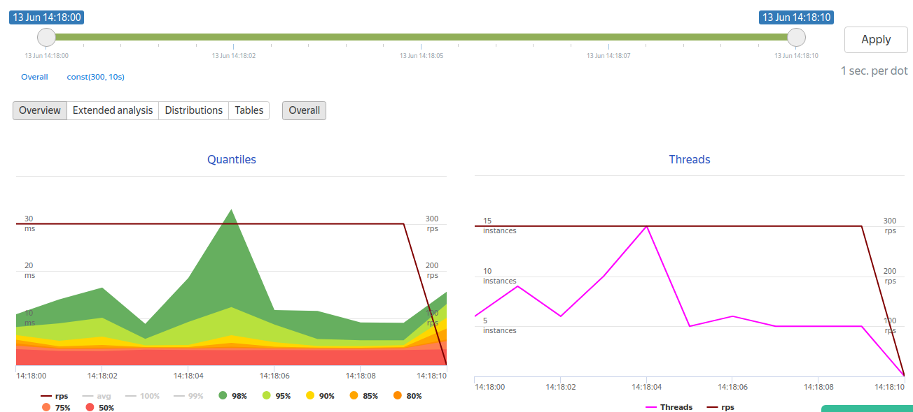

=== Опыты с RabbitMQ, Spring AMQP

*Задача*

Организовать RPC используя Spring AmqpInvokerServiceExporter через RabbitMQ

*Модули*

|===
|Название |Назначение
|link:service-interface/[service-interface]| Общий модуль.
Содержит сущности xref:service-interface/src/main/java/ru/perm/v/amqp/entity/Person.java[Person], xref:service-interface/src/main/java/ru/perm/v/amqp/entity/Town.java[Town], xref:service-interface/src/main/java/ru/perm/v/amqp/entity/Country.java[Country] и описание интерфейсов RPC сервисов xref:service-interface/src/main/java/ru/perm/v/amqp/service/PersonService.java[PersonService], xref:service-interface/src/main/java/ru/perm/v/amqp/service/TownService.java[TownService], xref:service-interface/src/main/java/ru/perm/v/amqp/service/CountryService.java[CountryService]
|link:client/[client]| RestController для вызова удаленных процедур
|link:person-service/[person-service]| Реализация сервиса PersonService
|link:town-service/[town-service]| Реализация сервисов TownService,CountryService
|===

xref:rabbitmq-run.sh[rabbitmq-run.sh] - скрипт запуска RabbitMQ в docker.
Имя и пароль для доступа _guest_

*Описание работы*

Контроллер принимает запрос, через интерфейс сервиса делает RPC. Описание запроса попадает в очередь RabbitMQ. Слушатель в *-service принимает запрос, обрабатывает и отправляет ответ в RabbitMQ. Ответ отправляется в очередь ответов RabbitMQ. Контроллер принимает ответ и отправляет потребителю.

*Запуск*

1. Запустить RabbitMQ

    ./rabbitmq-run.sh

2. Запустить принимающие сервисы

    cd person-service
    mvn spring-boot:run

    cd town-service
    mvn spring-boot:run

3. Запустить контроллер.
Настроен на порт 8080

    cd client
    mvn spring-boot:run

*Проверка работы*

[source,bash]
----
 >curl 127.0.0.1:8080/town/1
{"id":1,"name":"Perm"}
----

**Endpoints**

- GET /towm/all
- GET /towm/1
- GET /towm/2
- GET /country/all
- GET /country/1
- GET /country/2
- GET /person/all
- GET /person/1
- GET /person/2

*Нагрузочное тестирование*

Все сервисы запущены в одном экземпляре на одной машине.
Нагрузка 300 rps в течении 10сек.
Настройка теста для Яндекс-Танк в xref:tank/load.yaml[tank/load.yaml]

https://clck.ru/VV4sj

==== Ссылки

- https://docs.spring.io/spring-amqp/docs/current/reference/html/
- https://habr.com/ru/post/262069/
- https://www.baeldung.com/spring-remoting-amqp